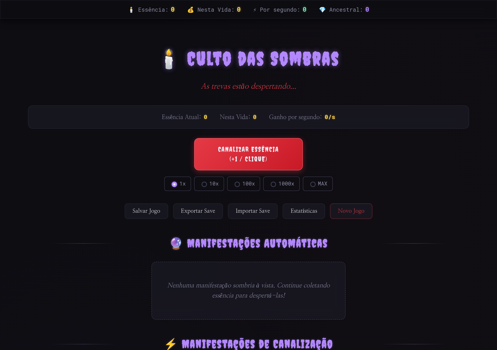
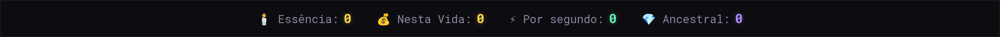
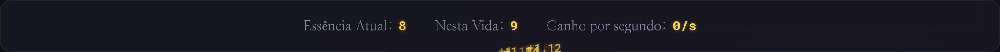
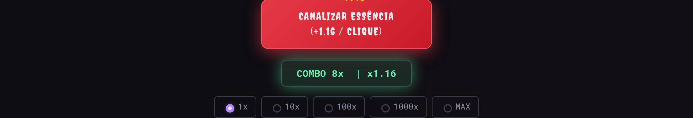
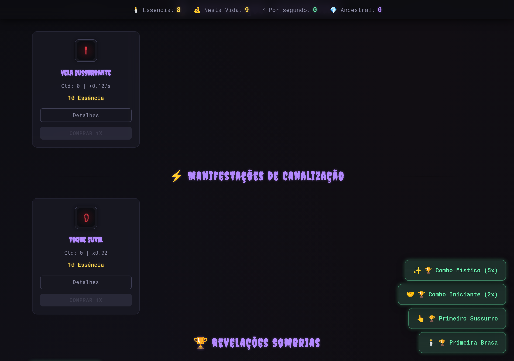
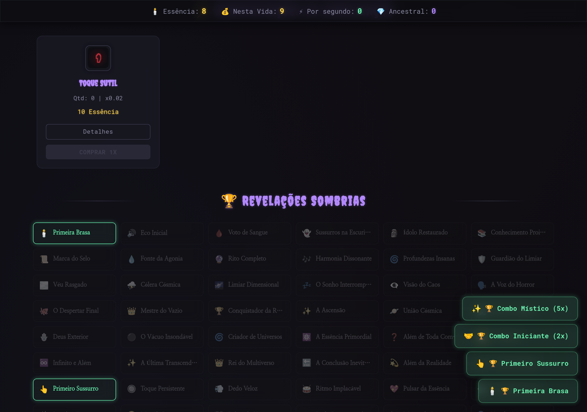
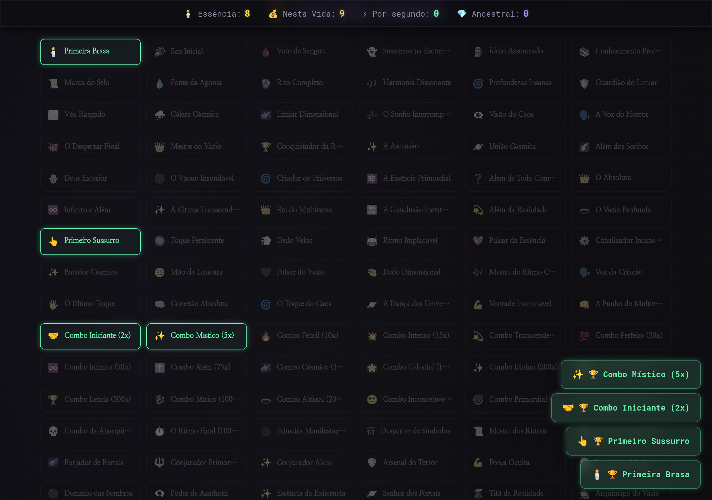
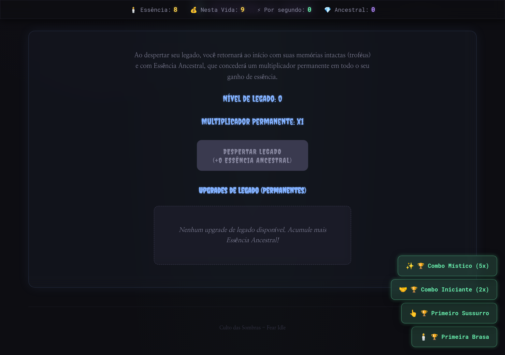
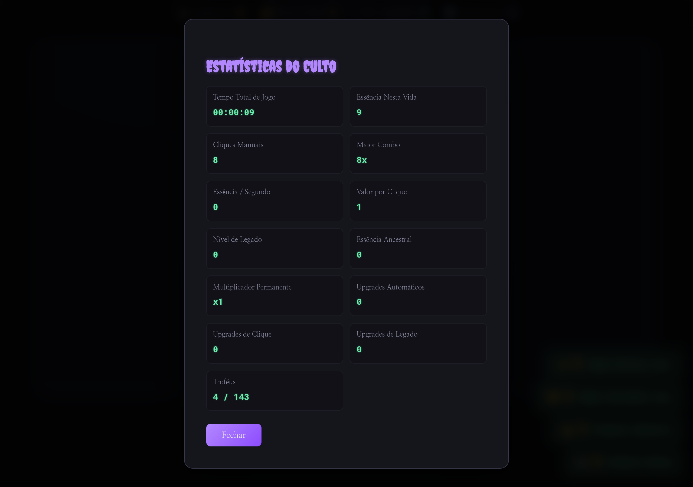
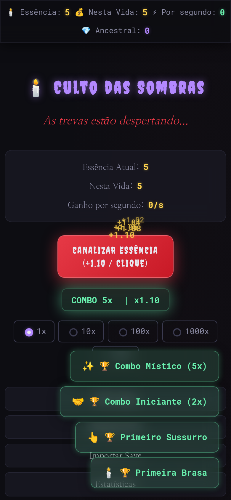

# Culto das Sombras

## Invoque o Medo, Conquiste o Vazio

Um jogo **idle/clicker** com tema de horror gotico e cosmico, construido com Angular 18. Canalize a essencia do medo, desperte entidades ancestrais e domine o vazio.



---

## Screenshots

### Header - Status em Tempo Real

Essencia atual, total nesta vida, ganho por segundo e essencia ancestral sempre visiveis.



### Estatisticas Rapidas

Painel central com resumo dos seus recursos.



### Area de Clique + Combo

Botao principal de canalizacao com floating numbers animados e sistema de combo dinamico.



### Manifestacoes Automaticas (DPS)

34 upgrades em 6 tiers que geram essencia passivamente. Cards com glassmorphism e informacoes de custo/dps.



### Manifestacoes de Canalizacao (Click)

24 upgrades que multiplicam o valor de cada clique. Desbloqueio progressivo por cliques totais.



### Revelacoes Sombrias (Trofeus)

143 trofeus organizados em grid. Conquistados brilham em verde, bloqueados ficam esmaecidos. Clique para ver detalhes.



### Despertar do Legado (Prestigio)

Sistema de prestigio com upgrades permanentes. Resete para ganhar Essencia Ancestral e multiplicadores globais.



### Estatisticas do Culto

Modal com 13 metricas detalhadas da sua jornada.



### Mobile

Design responsivo completo para dispositivos moveis.



---

## Recursos

- **Idle + Clicker**: Progrida passivamente com 34 manifestacoes automaticas (6 tiers) ou ativamente com cliques manuais e combos
- **24 Upgrades de Clique**: Cadeia progressiva de desbloqueio por cliques totais ou prerequisito anterior
- **Sistema de Combo**: Cliques consecutivos (timeout 3s) aumentam um multiplicador dinamico
- **Prestigio**: Resete para ganhar Essencia Ancestral e comprar 24 upgrades permanentes (DPS, Clique, Global)
- **143 Trofeus**: Marcos de essencia, cliques, combos, upgrades e prestigio
- **Save/Load**: Auto-save a cada 5 min, export/import em Base64, backup automatico em caso de corrupcao
- **Novo Jogo**: Botao de reset com confirmacao dupla via modal customizado
- **Design Responsivo**: Glassmorphism, tema dark cosmico, animacoes fluidas, floating click numbers

## Stack

| Tech | Uso |
|------|-----|
| Angular 18 | Framework (Signals, Standalone Components) |
| TypeScript | Tipagem, interfaces para Upgrade/ClickUpgrade/PrestigeUpgrade/Trophy |
| SCSS | Glassmorphism, variaveis de cor, mixins, responsivo |
| localStorage | Persistencia com TextEncoder/TextDecoder + Base64 |

## Arquitetura

```
src/
  app/
    app.component.ts       # Game logic, state management (~1060 linhas)
    app.component.html     # UI template
    app.component.scss     # Visual theme
  interfaces/
    Upgrade.ts             # Auto upgrades (DPS)
    ClickUpgrade.ts        # Click multipliers (com unlockClicks/unlockAfter)
    PrestigeUpgrade.ts     # Permanent multipliers
    Trophy.ts              # Achievements
    Toast.ts               # Notifications
  services/
    upgrade.service.ts     # Dados de 34 auto + 24 click + 24 prestige upgrades
    trophy.service.ts      # 143 trofeus + mapa declarativo de condicoes
```

### Decisoes Tecnicas

- **Game loop**: `setInterval(100ms)` com tick counter. DPS adicionado a cada tick (`essencePerSecond / 10`). Trofeus checados a cada 1s. Save a cada 5min.
- **Trophy conditions**: Mapa declarativo `Map<string, (state) => boolean>` no `TrophyService`, eliminando switch/case de 900 linhas.
- **Click unlock**: Data-driven via campos `unlockClicks`/`unlockAfter` na interface, eliminando cadeia if/else de 140 linhas.
- **Save merge**: Metodo generico `mergeList<T>()` reutilizado por `loadGame()` e `importSave()`.
- **Numeros grandes**: Notacao exponencial (`3e18`, `12e21`) para valores acima de `Number.MAX_SAFE_INTEGER` (9e15). Sufixos SI ate `De` (1e33), exponencial apos 1e36.
- **Modais customizados**: `showAlert()`/`showConfirm()` substituem `alert()`/`confirm()` nativos para manter consistencia visual.

## Balanceamento

| Aspecto | Valor |
|---------|-------|
| Cost scaling | 1.15x por compra |
| Prestige threshold | 10M essencia total |
| Prestige formula | `floor(cbrt(total / 10M))` |
| Combo timeout | 3 segundos |
| Combo bonus | +2% por hit |
| Click multipliers | 0.02 (tier 1) ate 0.6 (tier 5) |
| Global prestige mult | 1.5x ate 500x (por compra, custo dobra) |
| Prestige level bonus | +10% global por nivel |

## Como Jogar

1. **Clique** no botao principal para gerar essencia
2. **Compre** manifestacoes automaticas para renda passiva
3. **Aprimore** cliques com manifestacoes de canalizacao
4. Mantenha **combos** para multiplicar ganhos
5. Ao atingir 10M de essencia total, **prestigie** para ganhar Essencia Ancestral
6. Compre **upgrades de legado** permanentes
7. Repita o ciclo cada vez mais rapido

## Instalacao

```bash
# Requisitos: Node.js 18+ e Angular CLI
npm install
ng serve
# Acesse http://localhost:4200
```

### Build de producao

```bash
ng build --configuration=production

# Para GitHub Pages:
ng build --configuration=production --base-href /fear-idle/
```

## Contribuicao

Issues e Pull Requests sao bem-vindos.

## Creditos

- **Icones**: [Flaticon](https://www.flaticon.com/)
- **Fontes**: [Google Fonts](https://fonts.google.com/) (Creepster, Nanum Myeongjo, Roboto Mono)
- **Sons**: [Mixkit](https://mixkit.co/free-sound-effects/)
- **Tema**: Inspirado em horror cosmico Lovecraftiano e paleta Dracula
